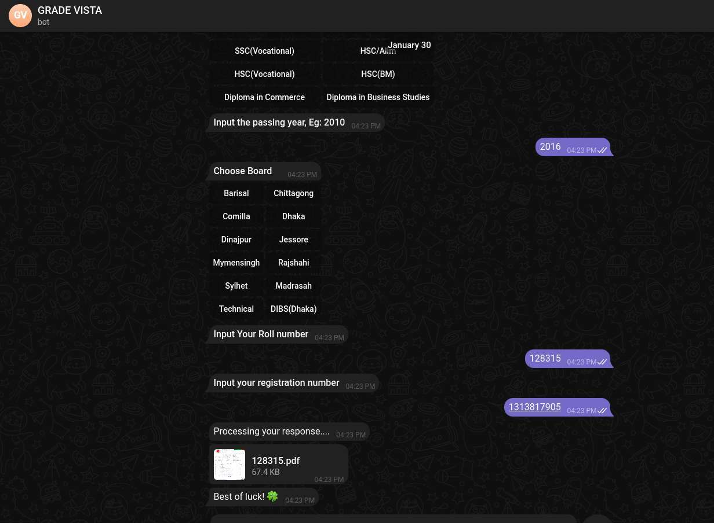

# GRADE VISTA Telegram Bot

The Examination Result Telegram Bot is a Telegram bot-based web scraping tool built using Node.js, Telegram API, and Puppeteer. It helps students retrieve their examination results from a [http://www.educationboardresults.gov.bd](http://www.educationboardresults.gov.bd/) conveniently through the Telegram messaging platform.

## Features

- **Interactive Interface**: Users can interact with the bot through Telegram, providing examination details and receiving result documents in PDF format.
- **Multiple Examination Types**: The bot supports various examination types including HSC/Alim, JSC/JDC, SSC/Dakhil, and more, catering to different levels of education.
- **Error Handling**: The bot includes error handling mechanisms to gracefully handle exceptions and ensure smooth operation even in case of errors.
- **Customizable Configuration**: Users can configure the bot settings through a configuration file to adapt the tool to different websites and requirements.

## Installation

To install and run the Examination Result Telegram Bot, follow these steps:

1. Clone the repository:

    ```
    git clone https://github.com/PrantaDas/GradeVista.git
    ```

2. Install dependencies:

    ```
    cd GradeVista
    pnpm install
    ```

3. Set up configuration:

    - Navigate to `config.js` and configure the bot token, base URL, and other settings as needed.

4. Run the bot:

    ```
    pnpm dev
    ```

## Usage

1. Start a conversation with the bot on Telegram.
2. Interact with the bot to input examination details and retrieve result documents.
3. Follow the prompts to provide examination type, passing year, exam board, roll number, and registration number.
4. The bot will scrape the result data from the website and provide the result document in PDF format.

## Configuration

The configuration file (`config.js`) allows you to customize the bot token, base URL, and other settings. Modify this file according to your requirements before running the bot.

```javascript
module.exports = {
    BOT_TOKEN: '<your-bot-token>',
    BASE_URL: 'http://www.educationboardresults.gov.bd/',
};
```
## Contributing
Contributions are welcome! If you'd like to contribute to the Examination Result Telegram Bot, please follow these steps:

1. Fork the repository.
2. Create a new branch for your feature or bug fix.
3. Make your changes and commit them.
4. Push your changes to your fork.
5. Submit a pull request to the main repository.


## Personal Apology
As the developer of the Examination Result Telegram Bot, I sincerely apologize for any oversights or shortcomings in the bot's functionality. Building a bot is a complex task, and despite my best efforts, there may be unforeseen issues or limitations that I failed to address. I understand that you rely on this bot to access your examination results conveniently, and any inconvenience caused by its shortcomings is deeply regrettable.

Please know that I am committed to continuously improving the bot's performance and user experience. Your feedback and suggestions are invaluable to me, and I encourage you to reach out if you encounter any difficulties or have ideas for enhancement. Your satisfaction and trust are my top priorities, and I will do everything in my power to ensure that the bot meets your expectations.

Thank you for your understanding and patience as I work to make the Examination Result Telegram Bot the best it can be. Your support means everything to me, and I am grateful for the opportunity to serve you better.

## Demo



**Made With  ❤️ By Pranta Das**